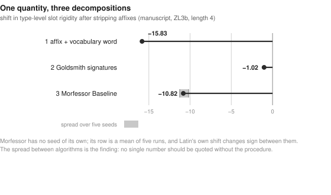
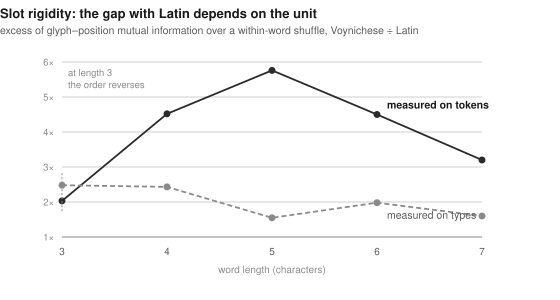
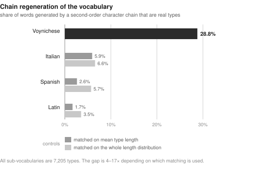

# What Survives? An Audit of the Voynich Anomaly Inventory

**Draft, 3 September 2026. Not submitted. Comments wanted, especially disagreement.**

*Companion paper: "What a Generator Must Have", which takes the residue left here
and asks what it constrains. The two share their data and their controls but not
their method, and either can be read alone.*

## Abstract

A century of work on the Voynich manuscript has accumulated an inventory of
claimed statistical anomalies: low conditional entropy, rigid positional structure
within words, adjacent repetition of whole words, unusual behaviour across the
word boundary, an exceptionally dense vocabulary. They are normally treated as
separate facts, and any proposed account of the text is expected to reproduce all
of them.

We re-examine seventy-five such claims, each against a null model matched on the
unit the claim concerns, on six independent transliterations and against eighteen
reference corpora each at least as large as the manuscript. **Twenty-two survive as
stated.** Of the remainder, thirty dissolve under a matched control, fifteen
shrink to a magnitude that decides nothing, two are consequences of something else
already in the inventory, and six are retractions — five of them of claims we made
ourselves in the course of this work.

Our own most promising positive result — an attribution of three famous anomalies
to the manuscript's affix layer — is among the retractions, and we describe its
collapse in detail (§3), because the way it failed is more useful than the claim
would have been. A decomposition criterion that requires the remainder of a
stripped word to be another word of the vocabulary is not independent of
vocabulary density; it therefore "explains" a density anomaly by construction. Two
further decompositions, one of them a standard tool, disagree with it.

One result is not deflationary: a character bigram chain trained on the
manuscript's own vocabulary regenerates 28.8% of its 7,205 word types, against
3.5–6.6% for language corpora matched on vocabulary size and on the whole
distribution of word lengths (§5.1). Matching the mean length alone, as we first
did, gives 1.7–5.9% and doubles the apparent gap; we report both.

A second is comparative. Rebuilding the three published accounts of Voynich word
structure and scoring each against the same vocabulary with its glyphs permuted
within words separates them where their reported coverage does not: Stolfi's
core–mantle–crust at 0.9×, Cham's curve–line system at 2.3×, Zattera's twelve-slot
model at 5.7× (§7a). Stolfi's constraint is satisfied more often by the shuffled
vocabulary than by the real one.

A prior-art sweep is reported in the same spirit as the retractions. Five results
we had marked as ours are not, three of the papers concerned having been cited by
us without being read, and our comparison set of eighteen corpora is an order of
magnitude smaller than the field's for character-level measures (§4.2, §7.2). What
we could return is a genre correction: those larger sets are Wikipedia-derived and
the manuscript is a book, which inflates the entropy gap by about half of itself
without overturning it, and makes the placement of Voynichese among language
families by lexical diversity unreliable.

Otherwise what we offer is negative and methodological: a count of how much of the
inventory is an artefact of its comparison, a demonstration that the unit of
measurement (type or token) substantially changes the manuscript's apparent
distance from Latin on two of the most-cited measures, and a worked case (§6) of a
statistic that is robust in every internal respect and still cannot support any
cross-corpus claim.

## 1. Introduction

Work on the manuscript divides into decipherment attempts and structural
description. This paper is entirely in the second category and makes no claim
about meaning.

The structural literature has a characteristic problem. An observation is made —
words repeat next to each other more than expected; the first word of a line
behaves differently; certain glyphs cluster at the top line of paragraphs — and
the "expected" against which it is measured is either a global shuffle, a rough
base rate, or nothing. Because the manuscript is structured at several levels at
once (line, paragraph, page, quire, two Currier dialects), the choice of null
model routinely changes the size of an effect by an order of magnitude, and
sometimes its direction.

Two recent papers set the context. Parisel (2026a, arXiv:2604.19762) evaluates a
parametric slot generator and a Cardan grille across their full parameter spaces
against a four-signature criterion, calibrated separately for Currier A and B,
and finds that neither reproduces all four. Parisel (2026b, arXiv:2604.25979)
models the Currier distinction with a Beta-Binomial mixture, recovering held-out
folio labels at 89%. Both are careful about what they do not establish; 2026a
describes its results as "descriptive, not explanatory" and lists a four-language
comparison set as a limitation. We reproduce two of its headline measures on its
own transliteration in §6a.

This paper asks a narrower question than either: of the claims already in
circulation, how many survive a null model matched to the unit they concern? The
companion paper takes what survives and asks what it constrains.
## 2. Data

**Transliterations.** All six IVTFF files distributed by Zandbergen, parsed with
identical cleaning rules: Zandbergen–Landini (ZL3b, 34,024 running-text tokens),
Takahashi (IT2a, 33,491), the Reference file used by Parisel (RF1b-e, 33,643),
Claston (GC2a, v101 alphabet, 36,436), FSG (FG2a, 32,881) and Currier/D'Imperio
(CD2a, partial, 15,736). The last three use non-EVA alphabets; Claston's has 68
symbols against EVA's 25, because sequences EVA writes as `ch`, `sh`, `cth` are
single characters there. Any result that is an artefact of EVA's segmentation
should fail on those files.

Analysis is restricted to running text (IVTFF locus `P`) unless stated. Labels,
circular and radial text differ from running text on nearly every measure we
tried and are excluded.

**Reference corpora.** Eighteen corpora of at least 34,000 words: six book-length
works from Project Gutenberg (Spanish, Italian, French ×2, English ×2), Pliny's
*Naturalis Historia*, an English literary corpus, three scriptural corpora
(Vulgate, Quran, Tanakh), a herbal corpus, and Wikipedia scrapes for Mongolian,
Hebrew, English, Spanish, French and Italian. Genre matters and we return to it
in §6: the manuscript is one book, and a Wikipedia scrape is not.

**Controls.** Every comparison states its null model. The recurring principle is
that the null must be matched on the unit the claim is about: a claim about lines
against shuffling within lines, a claim about the vocabulary against types rather
than tokens, a claim about a section against the same section split in half.
## 3. A retraction, and why it is the most useful part of this paper

Voynichese words admit a decomposition into stem plus affixes (Stolfi 1997,
2000; compare the slot models of Zattera 2022 and Greshko 2025). We tried to make
this quantitative and to use it as an explanation, and we were wrong. Since the
error is a general one, we set it out fully.

### 3.1 What we did

**Algorithm 1.** Take the vocabulary; select the 15 most frequent prefixes and 15
suffixes of length 1–3 by type count; call a type *derived* if it equals an affix
plus **another type of the vocabulary**, iterating to a fixed point. Applied
identically to every corpus at the manuscript's own size of 34,024 tokens, this
gives 57.2% derived for Voynichese against 15.7% (Latin), 20.6% (Vulgate), 23.5%
(Spanish), 24.4% (English), 27.5% (Italian) and 29.6% (French), and 6.2% for a
control that shuffles the glyphs within each type. Rates across the six
transliterations: 56.6–68.8% against a 6.2–13.8% shuffled baseline. Types
reducing twice or more: 40.6% against 2.7–9.5% for languages.

Two notes on those figures, both of which we owe to the re-checking described in
§3.2. The algorithm has a free parameter we did not report: capping the
vocabulary at the 5,000 most frequent types instead of using all of it changes
the manuscript's derived rate to 59.0% and roughly halves its density shift. And
an earlier version of this section quoted language rates of 9.9–30.1% from
corpora taken whole rather than cut to the manuscript's size; those are not
reproducible and the range above replaces them. Both corrections go against the
claim being made here, which is the claim we retract below.

Rewriting the running text in the resulting stems then appeared to remove three
well-known anomalies, in every transliteration:

- the neighbourhood-density ratio (mean edit-distance-1 neighbours at word length
  5 over length 3) fell from 0.73 to 0.40, against a language range of 0.24–0.41
  and Latin's own 0.41. The shift is negative in all six transliterations,
  −0.19 to −0.33, the smallest in the v101 alphabet, whose unstripped ratio is
  0.44 rather than 0.73;
- the excess single-character mutual information across the word boundary fell
  from 0.194 to 0.036, and to 0.021–0.048 across all six files. An earlier version
  added that this converged on Latin's own stripped value "to three decimals";
  measured with the same instrument Latin strips to 0.043, and the coincidence was
  an artefact of comparing two different runs;
- the type-level glyph–position association fell from 20.86× to 5.02× over a
  within-word shuffle, against Latin's 8.59× → 7.04×.

We ran three controls against circularity, since stripping removes exactly those
words that have an edit-distance-1 neighbour: removing the same number of
randomly chosen connected types gave −0.09; the same algorithm with randomly
chosen affixes gave −0.17; removing the same number weighted by neighbour count
gave **+0.58**, the opposite direction. Against the real −0.33 these looked
decisive.

### 3.2 What broke it

**Algorithm 2.** A second decomposition, structurally unlike the first:
Goldsmith-style signatures, in which stems are grouped by the *set* of suffixes
they occur with, and no reference to the vocabulary is made at all. Applying
Goldsmith's method to this text is not new — Reddy and Knight (2011) ran
Linguistica on the manuscript and reported the signatures it finds. What is new
here is its use as a control on algorithm 1 rather than as a description in its
own right. It recovers
sensible affixes in both corpora without supervision — `y`, `r`, `l`, `in`, `dy`,
`iin`, `aiin`, `ar` for Voynichese; `s`, `m`, `is`, `um`, `que`, `us`, `rum` for
Latin, which are the correct Latin inflections. It is not badly suited to either.

| | derived, Voynich | derived, Latin | density shift | junction shift | rigidity shift |
|---|---|---|---|---|---|
| Algorithm 1 | 57.2% | 15.7% | −0.33 | −0.157 | −15.8 |
| **Algorithm 2** | **24.9%** | **28.7%** | **−0.05** | **−0.014** | **−1.02** |

Under the density-independent criterion, **Voynichese is not more decomposable
than Latin — it is less so.** We checked twelve parameter settings of algorithm
2; the Voynich/Latin ratio runs 0.67–1.36×, below 1 in most of them. And
stripping under algorithm 2 does not remove the anomalies.

The reason is visible directly:

| corpus | neighbours per type | algorithm 1 | algorithm 2 |
|---|---|---|---|
| Voynich | 12.06 | 57.2% | 24.9% |
| Voynich, glyphs shuffled within words | 1.90 | 6.2% | 1.0% |
| Latin | 1.65 | 15.7% | 28.7% |
| Latin, glyphs shuffled within words | 0.46 | 1.5% | 0.2% |

Algorithm 1's derivation rate tracks vocabulary density across all four rows. It
requires the remainder to be a vocabulary word, and Voynichese has a dense
vocabulary, so the remainder is in the vocabulary almost by construction. Our
headline — 57% against 16–30% for languages — was in substantial part a
restatement of the density finding, not independent evidence about morphology.

**Algorithm 3.** Because both of the above are our own implementations, we
repeated the test with Morfessor Baseline 2.0.6, an established unsupervised
segmenter using a minimum-description-length objective. It also recovers sensible
morphs in both corpora: `y`, `dy`, `s`, `aiin`, `ar`, `or`, `daiin` for
Voynichese; `s`, `que`, `m`, `rum`, `tur`, `tum` for Latin.

| algorithm | derived, Voynich | derived, Latin | ratio | density | junction | rigidity |
|---|---|---|---|---|---|---|
| 1: affix + vocabulary word (ours) | 57.2% | 15.7% | 3.6× | −0.33 | −0.157 | −15.8 |
| 2: Goldsmith signatures (ours) | 24.9% | 28.7% | 0.87× | −0.05 | −0.014 | −1.02 |
| **3: Morfessor Baseline** | **88.1%** | **62.5%** | **1.41×** | **−0.02** | **−0.070** | **−10.8** |

*Figure 3. One quantity, three decompositions: the shift in type-level slot
rigidity after stripping affixes. Morfessor's row is a mean of five seeded runs;
the bar shows their spread, and Latin's own shift changes sign between them.*

All three rows are measured by one instrument: the same density, junction and
rigidity functions, with the within-word shuffle averaged over ten fixed seeds.
Morfessor's own training is not seeded, so its row is the mean of five runs; the
figures that vary materially between runs are marked where they appear below.

On the density profile — the anomaly the attribution was built to explain —
Morfessor does not move the manuscript at all (−0.02, and −0.035 to +0.013 across
five runs) while moving Latin by −0.26. Two independent decompositions, one of
them a standard tool, agree that **the density profile does not reduce to the
affix layer.** The retraction stands.

On slot rigidity they do not agree, and here even the arithmetic is unstable.
Morfessor takes the manuscript from 20.86 to about 10.0 while Latin goes from 8.59
to about 8.9, closing the gap from 2.43× to roughly 1.1× — but the post-stripping
values range over 9.6–10.7 and 7.8–10.2 across five runs, so that ratio is
anywhere between 0.9× and 1.4×, and Latin's own shift changes sign between runs.
Algorithm 1 does not converge on Latin either: it overshoots, taking the
manuscript to 5.02 against Latin's 7.04, so the gap reverses to 0.71×. Algorithm 2
leaves it at 2.06×. Three algorithms give −15.8, −1.02 and −10.8 for the same
quantity, and only one of the three leaves the manuscript anywhere near Latin.

That spread is the finding. The retraction is correct in the form *the attribution
is algorithm-dependent*, not in the form *there is no attribution*. For the density
profile the algorithms agree there is none; for slot rigidity they agree on
nothing, and no single number should be quoted without the procedure that produced
it. We note also that Morfessor segments very freely here — 2.14 morphs per word,
88% of types split — so taking its longest morph as a stem shortens words
substantially, and slot rigidity is length-sensitive even when measured at fixed
length, because the population of length-4 words changes.

### 3.3 The general lesson

Our three anti-circularity controls tested the *mechanics of removal* — how many
words were removed and how connected they were. They did not test what turned out
to matter: that **the selection criterion itself uses the quantity the removal
then explains.** No control on removal mechanics can catch that. What catches it
is a second selection procedure built on a different principle, and it has to be
specified before the first result is liked.

We therefore retract the attribution as a general claim. The density profile does
not reduce to the affix layer under any of the three decompositions; whether slot
rigidity does is undecidable from our evidence, since the three disagree. We also
retract the claim that Voynichese is unusually decomposable: the three algorithms
give ratios of 3.6×, 0.87× and 1.40× against Latin, which is not a finding but a
range of opinions about a procedure.
## 4. Type and token

This result does not depend on any decomposition and is measured on the raw text
at fixed word length 4.

| | Voynich | Latin | gap |
|---|---|---|---|
| glyph–position MI, tokens | 0.955 | 0.426 | 2.24× |
| excess over within-word shuffle, tokens | 531× | 118× | **4.52×** |
| glyph–position MI, types | 0.416 | 0.243 | 1.71× |
| excess over within-word shuffle, types | 20.9× | 8.6× | **2.43×** |
| conditional entropy h2, tokens | 2.31 | 3.07 | 0.75× |
| conditional entropy h2, types | 3.12 | 3.53 | **0.88×** |

Measured on types — the appropriate unit for a claim about how a vocabulary is
built — the manuscript's distance from Latin is substantially smaller than the
token measure reports, on both of these much-cited statistics. Bootstrapping over
words, the intervals do not overlap: slot rigidity 2.23 [2.12, 2.36] on tokens
against 1.64 [1.44, 1.91] on types; h2 0.75 [0.74, 0.76] against 0.88 [0.87,
0.90]. (Those are ratios of raw mutual information rather than of excess over a
shuffle, hence the different figures.) To this should be added the
transcription effect, on our own files: the character-level h2 of the running text
is 1.86 in EVA's 25 symbols, 2.05 in FSG's 23 and 2.29 in Claston's 68-symbol
v101, where EVA's `ch`, `sh` and `cth` are single characters.

Three qualifications, none of which was in an earlier version of this section.

The size of the effect depends on word length, and "roughly half" is the value at
length 4. Across lengths 4 to 7 the token measure inflates the gap by 1.86×,
3.71×, 2.27× and 2.00×. **At length 3 it reverses**: the type-level gap (2.48×) is
larger than the token-level one (2.03×).

*Figure 2. The gap with Latin on slot rigidity, measured on tokens and on types,
across word lengths 3 to 7. At length 3 the order reverses.*

Conditional entropy behaves more regularly and has no exception: the type-level
gap is closer to unity at every length — 0.96 against 0.84 at length 3, then
0.88/0.75, 0.81/0.63, 0.76/0.63, 0.73/0.61.

Across transliterations the rigidity effect reproduces closely in the three EVA
files (1.86×, 1.77×, 1.85×) and is absent in the two written in merged alphabets
(0.52× and 1.05×). We cannot say why. Those two have words a full character
shorter, so they could only be measured at length 3 — exactly where the effect
reverses in the EVA files as well. Alphabet and word length are not separable in
these data.

We do not claim more than this. The frequency skew at length 4 is in fact similar
in the two corpora (top five types cover 26.7% of Voynichese tokens against 28.0%
of Latin's), so the unit effect here is not driven by an unusual distribution; it
is the ordinary consequence of measuring a vocabulary property on a token stream.
An earlier and much more dramatic version of this result in our own notes (five
types covering 81.4% of tokens) was an artefact of the decomposition retracted in
§3.

### 4.1 A second quantity that turns over with the alphabet

Word length is usually said to be narrowly and almost binomially distributed in the
manuscript, unlike the wide asymmetric distributions of European languages (Stolfi;
Reddy & Knight 2011). The description is half right, and which half depends on the
transliteration in the same way the result above does.

Measured as relative spread on tokens, "narrow" holds everywhere: 0.33–0.39 across
all six transliterations against 0.47–0.57 for nine language corpora. Measured as
skewness on types, "binomial" holds only in the merged alphabets — +0.07 in FSG and
+0.11 in Claston's v101, against +0.30 to +0.40 for the languages, so genuinely
more symmetric — while EVA gives +0.99 to +1.06 and Currier +1.03, twice as skewed
as any language in the set. The sign of the anomaly turns over with the alphabet,
for the same reason as everything else here: EVA writes `ch` as two characters and
the merged alphabets write it as one.

### 4.2 Our comparison set against the field's

Two things belong here that we learned by reading rather than measuring, and the
first is a limitation of this section.

The low conditional entropy we measure against Latin has been measured by Bowern
and Lindemann (2021) against 250 languages, and by Lindemann and Bowern (2020)
against 294 Wikipedia samples and eighteen historical texts, with the manuscript
below every one of them at h2 ≈ 2.0–2.2 against a natural-language cloud between
3.0 and 4.0. Our unit argument does not touch that: it says the gap narrows when
the vocabulary rather than the text is the unit, not that the gap is ordinary.
Where we say "the manuscript's distance from Latin", the field can say "from any of
250 languages", and on this measure our comparison set is an order of magnitude
smaller than the best available. The same holds for the type–token ratio, where the
moving-average index introduced by Gheuens (2019) has been computed for 101
languages in seven families and places Voynichese in the ordinary range. We record
this as a limitation of our comparison set rather than repair it, since building a
250-language set was not in reach here. Those authors also supply a causal account
we do not: the low h2 follows from characters and combinations occurring
exclusively in one of the three positional fields of a word (Tiltman 1967, Stolfi
2000). And they perform the operation of our §3 — deleting affixes and re-measuring
entropy — to show that removing `qo-` and `-dy` makes the h2 of Currier A and B
nearly identical, 2.23 against 2.24.

The second thing is a contribution to theirs, and it is about genre. Those
comparison sets are Wikipedia-derived and the manuscript is a book: the same
mismatch that defeats the cross-corpus comparison in §6. Measuring the
character-level h2 of five languages for which we hold both a book and a Wikipedia
sample, at matched size, the genre shift is consistently positive and sizeable:
+0.27 (English), +0.24 (Spanish), +0.39 (French), +0.23 (Italian), +0.39 (Hebrew),
a mean of +0.30. The manuscript's distance to the nearest *book* value is 0.61.
**Their conclusion survives this** — against books alone the manuscript is still
below every one of them, by twice the genre effect — but the size of the gap is
inflated by roughly half of itself by the choice of genre. Where the rank
correlation of §6 died because the genre sensitivity exceeded the signal, here the
signal is twice the sensitivity, so what needs correcting is the number and not the
finding.

One measure over, the same question has a different answer. Lindemann (2022) places
Voynichese among language families using the moving-average type–token ratio and
the share of the ten most common words, against 160 languages, concluding that it
sits in the middle of the morphological-complexity range, closest to medieval
Germanic, with Turkic and Uralic excluded. That set is Wikipedia-derived too.
Between the languages this is a virtue — they are all the same genre, so the
comparison among them is controlled. It is the *placement of the manuscript among
them* that is not. On our five book/Wikipedia pairs the genre shift in MATTR is
+8.1, +2.4, +3.8, −5.6 and +16.6 points: a mean of +5.1, a range spanning
twenty-two points, and **not even consistent in sign**. The spread across the five
books themselves is 11.5 points. A quantity whose genre term is that large relative
to its between-language term will not place a text in a family reliably unless the
genre is matched, and here it cannot be. We report this as a caution on the method
rather than a correction to the result, since we hold five book corpora and he
holds one hundred and sixty languages.

## 5. What is left unexplained, and what left it

### 5.1 Neighbourhood density, mostly explained after all

Voynichese word types have 12.06 edit-distance-1 neighbours each against Latin's
1.65 — the largest single gap in the inventory, and after §3 the main thing
without an account. We therefore attacked it as hard as we had attacked the
claims we retracted.

It survives the first null. Generating a vocabulary with the same alphabet, the
same length distribution, the same type count, and each character drawn from the
observed distribution for its (length, position) — that is, preserving all the
positional structure and destroying everything else — gives 2.09 neighbours
against the observed 12.06, and a length profile of 0.23 against 0.73. Latin
gives 0.47 against 1.65. **Density is not a consequence of the manuscript's
positional rigidity.**

It does not survive the second. A character Markov chain of order 2, trained on
the vocabulary itself and matched on length distribution and type count, gives
9.60 neighbours — 80% of the observed value — and a length profile of 0.71
against 0.73, which is the flat profile essentially reproduced. Latin's own chain
gives 1.60 against 1.65, reproducing its density completely. The residual is
1.26× for the manuscript and 1.03× for Latin, and the manuscript's residual is
stable across four transliterations (1.22–1.26×, including the v101 alphabet).

So the density excess is largely downstream of the character transition
statistics — a property known since Bennett (1976) — rather than an independent
fact about the vocabulary. What is left is a residual of about 1.26×, which Latin
does not have.

One caveat cuts both ways. The Markov model partly reproduces rather than models
the data: 28.8% of the words generated by the order-2 chain are actual Voynichese
words, against 2.2% for Latin. On the generated words that are *not* in the
original vocabulary, density is 5.24 rather than 9.60, so "80% explained" is an
upper bound.

That memorisation figure is itself the sharper result, and it is the one claim in
this paper that we attacked deliberately and could not break — though the audit
below cuts its magnitude roughly in half.

**A chain that knows only adjacent character pairs regenerates 28.8% of a
7,205-type vocabulary** (28.9% averaged over twenty seeds, range 28.2–29.5%)**.** The obvious confound is that Voynichese has a smaller
vocabulary of shorter words than our language corpora, which should make it an
easier target. It runs the other way: the regeneration rate *rises* with
vocabulary size in every corpus, because a larger vocabulary is a larger target.
At 2,000 types the manuscript gives 12.1% against 0.3% (Latin), 0.6% (Spanish),
2.0% (English) and 2.1% (Italian).

Matching sub-vocabularies to the manuscript on both type count (7,205) and mean
type length (6.6–6.9):

| corpus | types | mean length | regenerated | ratio |
|---|---|---|---|---|
| **Voynich** | 7,205 | 6.64 | **28.8%** | — |
| Italian | 7,205 | 6.42 | 5.9% | 4.9× |
| Spanish | 7,205 | 6.91 | 2.6% | 10.9× |
| Latin | 7,205 | 6.89 | 1.7% | 17.2× |

**The size of that gap depends on how the vocabularies are matched, and we report
the sensitivity because our own rule (§8) requires it.** The table matches the
*mean* type length by drawing random sub-vocabularies until one falls within 0.25
of the target. A second and at least as defensible matching — draw from each
length band in the proportion the manuscript has — matches the whole length
distribution rather than its first moment, and gives higher figures for the
languages:

| corpus | matched on mean length | matched on the length distribution |
|---|---|---|
| Italian | 5.9% (4.9×) | 6.6% (4.4×) |
| Spanish | 2.6% (10.9×) | 5.7% (5.1×) |
| Latin | 1.7% (17.2×) | 3.5% (8.1×) |

*Figure 1. Chain regeneration under both matchings. All sub-vocabularies are
7,205 types; the gap is four- to seventeen-fold depending on which matching is
used.*

Five sampling seeds each, three chain seeds per sample; the intervals do not
overlap between the two procedures for Latin or Spanish. The manuscript's own
figure is stable — 28.9% over twenty seeds, range 28.2–29.5% — so the variation is
entirely in the comparison set. The result survives either way, but the honest
statement of it is a gap of **four- to seventeen-fold**, not the eighteen-fold the
first matching alone suggests. We report the stricter matching in the abstract.

Because the languages have too few short types to be matched downward completely,
we also matched upward, restricting the manuscript to its long types and
comparing against the languages' long types at three to four times the vocabulary
size: Voynich at length ≥ 7 gives 17.1% on 3,559 types, against Spanish 0.8% on
16,297 and Latin 0.3% on 13,447 — a gap of twenty to fifty-seven fold.

We state carefully what this is and is not. It is not the discovery that
Voynichese word structure is constrained, which has been known since Currier and
is the substance of every slot model from Stolfi onward. It is a quantification
of how constrained: a second-order character model recovers between a fifth and a
third of the actual lexicon. And it explains nothing on its own; it consolidates,
in that several separately-reported peculiarities of the vocabulary are
downstream of one fact about character transitions.

### 5.2 What remains

**No prohibition on repeating a word.** Against a shuffle *within lines*, which
preserves the line's own vocabulary and destroys only order, the manuscript gives
1.01× [0.92; 1.12], p = 0.62. This is not an excess of repetition, as usually
stated, but the absence of the suppression every language shows: Latin 0.02×,
English 0.08×. Thread 61 of voynich.ninja states the general point — sequential
repetition is an aspect of local repetition, which is an aspect of local
similarity; our contribution is the matched null and the cross-language range.

**A deficit of three-character information across the word boundary** — not ours.
Currier (1976) observed that a word's initial characters are affected by the final
characters of the word before it, and Reddy and Knight (2011) measured the
asymmetry we rediscovered: using the last character of the previous word to
predict the first character of the next improves on no context by 31.8% in the
manuscript against 31.1% in English — level — while using two characters gives
16.0% against English's 42.8%. Excess on one character, deficit on more. Our
contribution is the measure and the comparison set, not the observation. On the raw
text the manuscript gives 0.245 against 0.435 (Latin), 0.554 (Italian), 0.568
(Spanish), 0.643 (Vulgate), 0.744 (English) and 0.867 (French) — between 28% and
56% of a language's value, measured against the same word-order shuffle. The
contrast within one corpus is the sharp part: on *one* character the manuscript
is in excess of every language (0.194 against 0.047–0.147), on *three* it is in
deficit of every one.

An earlier version of this section gave 0.109 against Latin's 0.381 for this
measure. Those were computed on text stripped by algorithm 1 — the decomposition
retracted in §3 — and had no business in a list of what survives on the raw text.
The deficit itself survives the correction; its size does not, changing from 0.29×
to 0.56× of Latin.

One terminological trap is worth flagging before the next item, since we nearly
fell into it. Reddy and Knight (2011) report "very few repeated word bigrams" and
Amancio et al. (2013) report "unusually high duplicated bigrams". The phrases are
almost the same and the findings are opposite: the first counts bigrams occurring
more than once in the text, which are rare; the second counts bigrams made of the
same word twice, which are common. Both are true, and they belong to different
rows of our inventory.

**No repeated phrase longer than two words.** This is the field's own statement of
the main anomaly (Zandbergen), and it survives the sharpest comparison we can make:
a genre-matched medieval herbal. Counting the share of word n-gram occurrences that
appear more than once, at two words the manuscript's 23.4% is ordinary — Latin
gives 19.5% — but at three words it gives **1.20% against 6.5–23.0%** for every
other corpus, the herbal highest at 22.98%, and at four words 0.01% against
0.82–8.50%. Against its own within-line shuffle the bigram figure is only 1.29×,
the trigram figure 4.3×.

One refinement belongs here, and it is not ours. Ponzi (curated Graph Thread,
2018) compared observed against expected counts of the case where a word's last
letter equals the next word's first. The manuscript *avoids* it: 2.36% against
4.03% expected, a ratio of 0.59. So the excess of boundary information on one
character is not repetition of the same character — that particular pairing is
suppressed. Nor is the suppression unique: Italian gives 0.51, more strongly than
the manuscript, while Latin, English and the Vulgate sit between 0.89 and 0.98.

The shape is worth naming, because we have now met it twice at different scales. On
the character scale the manuscript is in *excess* of every language across one
character of the word boundary and in *deficit* across three. On the word scale it
is level with Latin across two words and an order of magnitude below everything
across three. Local coupling is present and extended coupling is absent, at both
scales. We do not have an account of why.

**The 1.26× density residual** of §5.1.
## 6. A measure we could not make usable

We report this case at length because it is the clearest illustration of the
paper's method, and because we were wrong about it twice, in opposite directions.

Consider the correlation between the log frequency ranks of adjacent words. In a
language it is negative: frequent function words alternate with rarer content
words. In the manuscript it is **positive**, +0.0797 — words of similar frequency
stand next to each other.

The effect is robust in every respect we could test. Across six transliterations
it lies in +0.0747…+0.0890, including the two non-EVA alphabets. Within the
manuscript it does not fade with sample size: +0.091, +0.103, +0.091, +0.082 at
6k, 12k, 25k, 34k. It is not an artefact of word segmentation: syllable-splitting
six languages, including agglutinative Finnish and Turkish, fails to flip the
sign of any of them.

**First error.** We reported it as unique, having compared the manuscript against
three corpora.

**Second error.** We retracted that on a sweep of 25 corpora at 6,000 words,
where six were positive and the manuscript ranked third. But at 6,000 words small
corpora give inflated positives: the Tanakh gives +0.051 there and +0.004 at
120,000.

**What is actually the case.** At 34,000 words — the manuscript's own size —
against 18 reference corpora each at least that large, only two are stably positive:
Mongolian Wikipedia at +0.098 and the manuscript at +0.082. Hebrew Wikipedia
(+0.041) and the Tanakh (+0.020) both fade with size, and two independent Hebrew
corpora agreeing on this closes the hypothesis that the positive group shares a
writing system in which the orthographic word packs morphology.

**Why the comparison cannot be settled.** The one corpus above the manuscript is
a Wikipedia scrape; the manuscript is a book. Measuring the genre shift on the
five languages where we have both gives +0.166 (English), +0.068 (French), +0.058
(Spanish), +0.022 (Hebrew), −0.037 (Italian): mean +0.055 with a 95% interval of
[−0.010; +0.121]. Corrected for genre, Mongolian lies anywhere between −0.023 and
+0.108, and the manuscript falls inside that interval. Worse, the genre
sensitivity of the measure — up to 0.166 within a single language — exceeds the
manuscript's entire signal.

A second, equally defensible correction reverses the order. Regressing the
measure on type-token ratio across the 19 corpora (18 references plus the manuscript), the manuscript has the largest
residual at +2.44 sd, above the Tanakh (+1.74) and Mongolian (+1.55): the
manuscript reaches +0.082 at a *low* TTR of 0.212 where Mongolian reaches +0.098
at 0.301. But +2.44 sd is barely above the expected maximum of 19 standard
normal draws (≈2.0).

Two defensible corrections, two different orderings, and no principled reason to
prefer one. **The measure describes the manuscript's structure but cannot support
a claim about its unusualness in either direction.** Settling it would require a
book-length Mongolian corpus, which we could not obtain.
## 6a. Reproducing Parisel (2026a) on his own file

Because our reading of the field depends on that paper, we attempted to
reproduce its headline measures on the transliteration it uses (RF1b-e), parsing
it with our own rules. Our reconstruction of the method comes from the text of
the preprint, not from its code, so any failure below may be ours.

| measure | Parisel | ours, RF1b-e |
|---|---|---|
| tokens | 37,016 | 36,258 (all loci) / 33,775 (running text) |
| end-class → start-class transitions | 80.6% | **80.9% / 81.5%** |
| within-class share of cross-boundary MI | 97% | **98%** |
| grapheme polarization, manuscript | 0.786 | 0.754–0.782 |
| grapheme polarization, languages | 0.694–0.860 | 0.517–0.631 |
| cross-boundary MI | 0.223 | 0.171 |
| the same, word order shuffled | 0.049 | 0.008 |
| drop | 78% | 96% |

The two structural claims reproduce closely: the 80.6% end-to-start transition
rate comes out at 80.9–81.5%, and the 97% within-class concentration of
cross-boundary information at 98%. Our end-to-start figures for English (28.6%
against his 25.7%) and Hebrew (28.6% against 28.7%) are also close, though our
French corpus gives 47.9% against his 35.5%, which is likely a corpus difference
rather than a method one.

Two things do not reproduce. Our polarization statistic agrees with his for the
manuscript but is far lower for the languages, so our definition must differ from
his in a way that matters more for languages than for Voynichese. And we cannot
reproduce his mutual-information pair at all: our observed value is 0.171 against
0.223, and our shuffled baseline 0.008 against his 0.049. We tried three null
models — a global word shuffle, a shuffle within lines, and a shuffle preserving
word length per position — and they give 0.007, 0.014 and 0.007 respectively. To
obtain his 78% drop from our observed value the baseline would have to be 0.038,
five times what any of our shuffles produces.

We do not think this affects either paper's conclusions, since both rest on the
size of the drop rather than on the absolute values, but it does mean the two
sets of numbers are not directly comparable, and anyone combining them should be
aware of it. We would welcome the correction.
## 7. The inventory

Seventy-five claims examined. **Twenty-two survive as stated.** Of the other
fifty-three: thirty dissolve under a matched control, fifteen shrink to a magnitude
that decides nothing, two are consequences of something else in the inventory, and
six are retractions. Twenty-eight of the seventy-five are claims we advanced
ourselves; forty-seven are other people's, and in most of those cases the control
confirms the observation while changing its statement.

Five of the six retractions are of our own claims, and five out of twenty-eight is a poor
ratio. We report it rather than quietly dropping the failures, because the shape of
the failures is the paper's content. Four of the six died the same death: a
comparison set or a selection criterion that was not independent of the quantity
being explained.

The last three rows were added together, on targets picked by a criterion worth
stating: a small hypothesis space, key material internal to the artifact, and a
verdict a pre-registered null can actually deliver. The f57v ring — seventeen
glyphs written out four times, and so a deliberate list rather than text — bears
no relation either to the glyph order the text itself implies (ρ = −0.06) or to
glyph frequency (ρ = −0.10); the glyph *r* also occupies two of its seventeen
places, which alphabets do not do. The zodiac nymph labels, whose markup admits
the counting hypothesis unusually well — fifteen or thirty labels on every one of
the twelve pages, clock angles monotone within each ring — show no agreement by
position across pages: 0.3582 against a null of 0.3577, where the same test
detects a counting sequence with sixty per cent of its positions corrupted. The
third row is not about the manuscript but about a method. Pharmaceutical labels
fit plant names no better (0.690) than they fit random letter strings (0.676),
while the same fitter under the same budget recovers a known substitution of
plant names exactly (1.000); the high score against Latin (0.807) is the density
of that comparison pool, since genuine ciphertext scores 0.834 against it with
Latin the wrong target. A crib fit at that level is not evidence, and the point
holds for a class of published attempts rather than for any one of them.

Of the four most-cited peculiarities — low entropy, rigid slots, adjacent
repetition, boundary behaviour — the first two are roughly halved by measuring
types instead of tokens (§4), the third is the absence of a prohibition rather
than an excess (§5), and the fourth remains as stated.

### 7.1 Sweeping the table for the disease that caused two retractions

We swept the table itself, asking of every row whether its null model contains the
mechanism whose sufficiency is in question or destroys it along with everything
else. It found no third instance, but it found something we had not looked for:
**three rows carried no null at all.** Two of them — the Zipf slope and the
word-length autocorrelation — now have one, and both survive: the Zipf slope of
−1.165 sits inside the eighteen-corpus range of −1.229 to −0.769, and the
autocorrelation is treated in the companion paper's §2.1. The third, the hapax
rate, was marked as surviving on a comparison with Latin alone; against eighteen
corpora the manuscript's 0.697 is above every one of them (0.420–0.694, Latin
closest at 0.694). It is a small exceedance and we record it as weakened rather
than confirmed, but the direction reverses: the hapax rate is not language-like, it
is at the top of the language range. That is recommendation 3 below, violated in
our own table.

The sweep also supplied a control the affix result never had. "Unsupervised affix
discovery recovers the canonical affixes" is close to tautological if both lists
are simply the frequent substrings at word edges. Running the same selection on a
vocabulary whose glyphs are shuffled within each word recovers 5.9 of the 16
canonical affixes on average against 16 of 16 from the real vocabulary, and every
one it finds is a single glyph: the multi-character suffixes (`dy`, `iin`, `edy`)
it never finds at all. The claim survives, and now it is not a tautology.

### 7.2 What reading the literature took back

Of the claims we had marked as ours, five are not, and three of the papers
concerned we had cited without reading.

The deficit of three-character information across the word boundary was observed by
Currier (1976) and quantified by Reddy and Knight (2011), who found the same
one-character against two-character asymmetry fifteen years before us by a
different measure. Applying Goldsmith's unsupervised morphology to this text —
the control that forces the retraction in §3 — was done by the same authors in the
same paper. The line-edge character bias and the within-line scramble that controls
it are theirs as well, confirming Currier. The weak word order we establish as
existing at all was measured by them as an 8.85% improvement in word predictability
from bigram context, against 151% for English and 123% for Hungarian: so it exists,
and it is an order of magnitude weaker than any language they tested. And the
methodological point of §7a below — that a model's tightness reveals more than its
coverage — was made by Pelling in 2010 and formalised by Zattera in 2022; an
earlier draft of this section claimed it as an observation of our own.

Reading also showed that on one claim we had measured the weak version and missed
the strong one. Row A1 tests Stolfi's three-layer nesting — core, mantle, crust —
and finds it barely above its own shuffle, which is honest, since with three
classes and short words almost any sequence is unimodal. The stronger claim, that
the characters of a word follow a stable left-to-right order, we had never tested:
it holds at 28.1% against 4.0% for a within-word shuffle.

The full table, with the null model applied to each claim, is in the appendix and
in machine-readable form in the accompanying code.

## 7a. Three models of word structure under one null

The field judges a model of Voynich word structure by two quantities. Coverage is
the share of real words it generates. Tightness — Pelling's term, from his 2010
review of Sean Palmer's generator, where coverage of 95% meant little because the
paradigm "produces way too many words" — is the share of generated strings that are
real; Zattera (2022) formalises it as precision and tabulates recall, precision and
F1 for eight published grammars.

We can add a third. The null ratio is a model's coverage relative to its coverage
of the same vocabulary with the glyphs permuted within each word. Tightness asks
whether a model over-generates arbitrary strings; the null asks whether what it
does capture exceeds what the glyph inventory imposes by itself. The two can
disagree, and on these models they do: Zattera's slot model has a tightness of
roughly 0.0007 — 4.6 million generated strings for 3,347 real types — and the
highest null ratio we measure, while his pruned grammar reverses that with a
tightness of 0.358 and coverage low enough to fail at the second most frequent
word.

Two of the three accounts state their rules completely enough to rebuild, and ours
reproduce. Zattera's twelve-slot model classifies 83.1% of our running-text tokens
as regular against the 86.6% he reports, and the first word it fails to generate is
rank 95 against his 89, the difference being that we use running text in one
transliteration where he uses a majority transcription across all loci; his pruned
grammar generates 1,140 of our types against his 1,113. Cham's curve-line system
(2014), which Zattera reports his grammar independently confirms, does not
reproduce exactly: our base coverage is 44.7% of types against his 71.49%, and our
base-plus-first-patch figure of 71.4% coincides with his base, which suggests his
glyph classification differs from ours in precisely what that patch supplies.

| model | manuscript | glyphs shuffled within words | ratio |
|---|---|---|---|
| Stolfi, core–mantle–crust | 88.5% | 93.6% | **0.9×** |
| Cham, curve–line with both patches | 76.8% | 33.5% | **2.3×** |
| Zattera, twelve slots | 46.5% | 8.2% | **5.7×** |

Stable to within a tenth across five shuffle seeds. By reported coverage the three
look level — 88.1%, 96.63% and 86.6% in their authors' figures — and by this ratio
they do not. **Stolfi's constraint is satisfied more often by the shuffled
vocabulary than by the real one**: a word whose class sequence rises to a peak and
falls is nearly any word, and permuting its glyphs makes it slightly more so. That
is not a new verdict, since Zattera's table gives that grammar a recall of 0.881 —
matching the coverage we measure — against a precision near zero and an F1 of zero.
It is an independent one, and the two instruments agreeing where both apply is
worth more than either alone. Where they do not both apply, Cham's system being
absent from that table, the null still ranks it, and it lands between the other two.

The comparison of ratios is robust to our imperfect reconstruction of the
curve-line system; the absolute coverages are not.

## 8. What this implies for future proposals

A generative account of Voynichese is normally asked to reproduce the anomaly
inventory. That requirement is weaker than it looks, and a model can satisfy it
without explaining anything. We built such a model ourselves — a slot template
with multiple forms per word, nulls, and a bias toward reusing the form nearest
the previous one — tuned it until it matched hapax rate, adjacent repetition,
slot rigidity and word length, and then found it failed four of seven measures
discovered afterwards. Parisel (2026a) makes the stronger version of the point by
sweeping whole parameter spaces rather than one tuned instance.

Five recommendations, each of which we violated at least once in this work.

1. State the null model, and match it to the unit the claim concerns.
2. Report types and tokens separately; on this text they differ by a factor of
   two on measures people quote as if the unit were incidental.
3. Build the comparison set before obtaining the result, matched on both axes —
   number of corpora and size of each. A claim can die from either, and ours died
   from both, in opposite directions, on the same statistic (§6).
4. **If a procedure selects on the quantity it is meant to explain, no control on
   the mechanics of that procedure will catch the circularity.** Only a second
   procedure built on a different principle will, and it must be specified in
   advance.
5. When a generative account is tested, declare which measures are fitted and
   which are held out *before* the run, and report the held-out ones whatever
   they say. Every result in the companion paper was obtained this way, and the
   claim there we had to withdraw — that each memory supplies exactly one
   signature — was caught by a mechanism we had not thought of, not by a held-out
   measure. The discipline is necessary and not sufficient.
## 9. Limitations

The word segmentation is no longer merely assumed. The ZL transliteration marks
18.4% of its spaces (7,923 of 42,953) as uncertain; our parser silently treated
them as ordinary spaces. Reversing that decision — joining across every uncertain
space — and, as a harsher test, joining the same proportion of *randomly chosen*
spaces, gives:

| measure | as parsed | transcriber's joins | random joins | Latin |
|---|---|---|---|---|
| rank correlation | +0.0797 | +0.0890 | +0.0478 | −0.087 |
| adjacent identity | 1.01 | 1.08 | 1.04 | 0.02 |
| neighbourhood density | 12.06 | 10.60 | 7.40 | 1.65 |
| density shape | 0.73 | 0.73 | 0.72 | 0.41 |
| junction, 1 character | 0.194 | 0.160 | 0.193 | 0.047 |
| slot rigidity (types) | 21.00 | 22.11 | 18.40 | 8.59 |
| chain regeneration | 28.6% | 26.4% | 19.7% | 1.5% |

Two figures in that table differ in the last digit from the same quantities
elsewhere in the paper — slot rigidity 21.00 against 20.86 in §3–§4, chain
regeneration 28.6% against 28.8% in §5.1 — because the re-segmentation script
carries its own copy of the estimator, with different shuffle and chain seeds.
Both quantities are stochastic at that precision (the chain figure ranges
28.2–29.5% over twenty seeds), all four columns of the table use one estimator,
and nothing in the comparison turns on it. We leave the figures as the script
produced them rather than harmonise them by hand.

Incidentally, the transcriber's uncertainty is informative: joining exactly the
spaces he marked preserves more structure than joining random ones (rank
correlation +0.089 against +0.048, density 10.60 against 7.40, regeneration 26.4%
against 19.7%).

No conclusion in this paper depends on the segmentation being right. Destroying
18.4% of word boundaries at random leaves every measure far from its language
values; the density shape and the one-character junction excess do not move at
all. Two alternative segmentations are not all of them, and a systematically
wrong segmentation of some third kind would not be caught by this, but arbitrary
re-segmentation does not threaten the results.

There is also a method that answers the segmentation worry without going through
the spaces at all, and we should have used it sooner. Landini (2001) applied
spectral analysis to the character stream with the spaces deleted and recovered an
indication of the modal token length from the periodicity alone. Repeating that in
a simple form — the autocorrelation of each frequent character's indicator sequence
in the space-free stream — six of the eight most frequent characters peak at lags 4
to 6, bracketing the mean word length of 5.07, with amplitudes up to 1.69. Shuffling
the same stream flattens every curve to 0.97–1.04. Latin with its spaces deleted
gives no coherent peak at all: its four most frequent characters peak at lags 2, 2,
3 and 11 against a mean word length of 5.81, with amplitudes between 0.75 and 1.21.
The manuscript's word structure is therefore recoverable from the character stream
*better* than Latin's is, which follows from how stereotyped its words are, and it
does not depend on the transcriber's spaces being right.

The sharpest version of that third kind is the position that the glyphs are not a
writing system at all — for instance the proposal of García Jiménez
(voynich.ninja thread 2384) that they encode an astronomical rather than a
phonetic system. Nothing we measure refutes it: low conditional entropy, rigid
positional structure and a chain-regenerable vocabulary are all compatible with a
non-linguistic symbol inventory, and this paper makes no claim about meaning. What
our measurements are statistics *of*, on that reading, is the transliteration
rather than a language. We record it as the limit of the method rather than as a
result, with one observation that is in our reach: the specific quantitative
prediction that folio f70r1 carries sequences of the glyph `o` used as a counter
does not hold in the transliteration. On that page the longest run of consecutive
`o` inside a word is one, and across the whole manuscript runs of length two
occur 79 times and longer runs never. Nor does `o` behave like a free counter
anywhere: 97.8% of the 5,344 occurrences of `q` are followed by it. That folio is
radial and circular text, which our analysis excludes throughout, so the check is
of the prediction on its own ground and not a defence of our scope.

The comparison set is 18 reference corpora at ≥34,000 words, weighted toward
European languages and scripture; §4.2 records how much smaller that is than what
the field uses for character-level measures. The one corpus that would settle §6 —
a book-length Mongolian text — is missing.

The neighbourhood-density ratio is transcription-dependent in absolute value and
should be quoted per file.

Two of the three decompositions in §3 are our own implementations; the third is
Morfessor Baseline 2.0.6. A reader who trusts none of them should read §3 only as
a demonstration that the attribution is algorithm-dependent, which is all we now
claim for it.

Seventy-two claims are audited here; twenty-two further claims arising from
generative modelling are in the companion paper, which is why its count differs.

All measurements are by one author with no independent replication. What we can
offer instead is machine-checked internal consistency. Each recurring quantity —
neighbourhood density, the length profile, slot rigidity, conditional entropy,
the junction, the four sequence signatures, the affix decomposition — is defined
once, in `scripts/measures.py`, with its seed and its number of repetitions in
the function signature. `scripts/paper_numbers.py` recomputes 83 load-bearing
figures from those definitions and `scripts/check_paper.py` verifies that each
appears in the text where it should, that the appendix matches the
machine-readable inventory row for row and verdict for verdict, and that no
section cross-reference dangles. It exits non-zero on any disagreement.

Those 83 cover a tenth of the numbers printed in this paper; the check reports its
own coverage, and the size of the manifest is itself one of the checked figures, so
neither can quietly decay. The rest are
derived quantities, other people's figures, and values from scripts not yet in
the manifest.

This was built after a consistency pass found eleven discrepancies in an earlier
version of these two papers, of which the automated check would have caught
eight. It found two more in its first run: a three-character junction figure in
§5.2 computed on text stripped by the decomposition retracted in §3, and a
recurrence statistic that a re-implementation had silently redefined. What it
cannot check is whether a definition is the right one, or whether an alternative
procedure would give a different answer — the two failures in this paper that
mattered most (§3.2, §5.1) were of exactly that kind.

The code and the parsed corpora are available; we would rather be corrected than
not.
## Acknowledgements

This work depends throughout on transliterations by Zandbergen and Landini,
Takahashi, Claston, and the Friedman group, and on observations by Currier,
Tiltman, Neal, Stolfi, Timm, Jackson, Pelling, Emma May Smith, Zattera, Greshko
and the voynich.ninja community. Where a result is a control under someone else's
observation, we have tried to say whose it is.
## Appendix. The inventory

Seventy-two claims, each with its source, the null model applied, and the outcome.
Machine-readable version, with the numbers for each row, in `scripts/inventory.py`.
### Vocabulary and word structure

| # | Claim | Source | Control applied | Outcome |
|---|---|---|---|---|
| A1 | Words are built from ordered positional slots | Stolfi 1997/2000; Zattera 2022; Greshko 2025 | within-word glyph shuffle; same glyph classes on Latin | weakened |
| A1b | The characters of a word follow a stable left-to-right order | Tiltman 1967; Stolfi 2000; Zattera 2022; Zandbergen's survey at voynich.nu/a3_para | order by mean relative position, against a within-word shuffle | survives |
| A1c | The curve-line system describes word structure | Cham 2014; independently confirmed by Zattera's grammar | the rule implemented with both patches, plus a within-word shuffle null that the field does not report | weakened |
| A2 | Voynichese is more decomposable into affixes than languages are | ours (strengthening Stolfi 1997) | three decompositions: affix-plus-vocabulary-word, Goldsmith signatures, and Morfessor Baseline 2.0.6; combinatorial baseline with glyphs shuffled within words | **retracted** |
| A3 | Affix stacking is the distinctive property | ours | reduction depth, but only under the density-biased algorithm 1 | **retracted** |
| A3b | Algorithm 1's figures are independent of its free parameters | ours (methodological premise) | settings swept: full vocabulary against the 5,000 most frequent types, 15 against 20 affixes, minimum remainder 2 against 3 | dissolves |
| A4 | Unsupervised affixes coincide with the canonical ones | community | the same selection on a within-word-shuffled vocabulary, 20 seeds; positive control on Latin | survives |
| A5 | Latin is equally decomposable given enough affixes | ours (test) | affix inventory raised to 400 | dissolves |
| A13 | A hard within-word rule: `i` is followed by `i` or `n`, and `n` is almost always preceded by `i` | community; davidjackson's summary, curated thread 4779 | direct bigram count on running text against the stated 90% | survives |
| A14 | Edit-distance-1 neighbourhood reduces to the known substitution classes | ours (test of a community claim) | the six classes of thread 4779 against the full edge set | dissolves |
| A15 | The word-length distribution is narrow and almost binomial, unusually for a language | Stolfi; Reddy & Knight 2011; Zandbergen's survey a4_word | skewness and relative spread on six transliterations, types and tokens, against nine corpora | weakened |
| E3b | About half of all types are hapax | Zandbergen's summary | direct count on six transliterations, both scopes | dissolves |
| A6 | Word types have anomalously many edit-distance-1 neighbours | close to Timm | two nulls: positional (char by length and position), and a character Markov chain | weakened |
| A6b | The chain-regeneration gap is independent of how the vocabularies are matched | ours (methodological premise) | two defensible matchings: on mean type length, and on the whole length distribution; 5 sampling seeds x 3 chain seeds | dissolves |
| A7 | The flat density profile is attributable to the affix layer | ours | affix stripping plus three controls -- insufficient; a second algorithm gives no effect | **retracted** |
| A8 | Glyph-position rigidity is a property of the vocabulary | Bennett; Landini; many | types vs tokens on raw text, fixed word length, within-word shuffle | weakened |
| A9 | The stem vocabulary is a combinatorial grid | ours | grid built on half the stems, coverage measured on the other half | dissolves |
| A10 | Word length is stable; labels do not differ in it | ours | manual inspection of locus composition | **retracted** |
| A11 | The affix attribution is robust to the choice of decomposition algorithm | ours (methodological premise) | two independent decompositions: Goldsmith signatures with no vocabulary reference, 12 parameter settings, and Morfessor Baseline 2.0.6, an established tool segmenting by minimum description length | dissolves |
| A12 | The vocabulary is very nearly determined by its character transitions | ours | share of chain-generated words that are real vocabulary words; same measure on Latin | survives |
### Sequence and order

| # | Claim | Source | Control applied | Outcome |
|---|---|---|---|---|
| B1 | Adjacent word repetition is anomalously frequent | thread 61 (as an aspect of local similarity) | shuffle within lines, not globally | attributed |
| B2 | The absent repetition prohibition survives affix stripping | ours | text rewritten in stems, same treatment for Latin | survives |
| B3 | Adjacent words do not alternate in frequency; the sign is reversed | ours | 18 corpora each >=34k; TTR correction; syllable-splitting; six transliterations | weakened |
| B3d | The measure can support cross-corpus claims about the manuscript | ours (methodological premise) | genre shift measured on five languages with both a book and a Wikipedia corpus; TTR regression | dissolves |
| B3c | The positive group shares a writing system packing morphology into the word | ours (hypothesis) | Hebrew extended to 60k; Tanakh as a second independent Hebrew corpus | dissolves |
| B3a | The positive sign is a segmentation artefact (tokens are syllables) | ours (alternative hypothesis) | syllable-splitting of six languages including agglutinative ones | dissolves |
| B3b | The measure discriminates the manuscript at 6,000-word samples | ours (interim conclusion) | same corpora compared at 6k and 34k | **retracted** |
| B5 | Word order carries no information at all | ours (hypothesis) | shuffle within a sliding window, preserving local composition | dissolves |
| B6 | Word-boundary structure is attributable to the affix layer | E. M. Smith (End-End); Sazonov 2003; Parisel 2026a | affix stripping -- but the second algorithm shifts it by only -0.014 | **retracted** |
| B7 | A deficit of three-character boundary information | Currier 1976 (the observation); Reddy & Knight 2011 (the asymmetry between one and two characters) | affix stripping, matched samples | survives |
| B7b | Each quantity in the project has one definition | ours (methodological premise) | canonical module against what individual scripts print; negative test on altered figures | dissolves |
| B8 | Word recurrence decay is language-like | close to Montemurro & Zanette 2013 | full distance range rather than the first six points | survives |
| B10 | Adjacent word order is asymmetric: a given pair runs almost only one way | community; davidjackson's summary, curated thread 4779 | direct count of both orders on running text | survives |
| B11 | The manuscript has no repeated phrases longer than two words | Zandbergen, who calls it one of the main anomalies; Tiltman 1967 and Currier 1976 on repetition | share of repeated word n-grams across eight corpora at 34,024 tokens, including a genre-matched herbal; within-line shuffle | survives |
| B12 | Characters correlate at long range, especially beyond 72 characters | Schinner 2007, summarising Reddy & Knight and Zandbergen | character autocorrelation at lags 1–150 against a shuffle of the same stream | weakened |
| B13 | Distances between similar words are geometrically distributed | Schinner 2007 | distance to the nearest edit-distance-1 word, 21,550 cases; fit compared with a word-shuffled control | survives |
| B14 | A word's last letter avoids matching the next word's first | Marco Ponzi, curated Graph Thread 2018 | word-order shuffle within lines, 20 repetitions, seven corpora | weakened |
| E5 | The manuscript obeys Heaps' law | David Jackson, curated Graph Thread 2018 | exponent fitted over 0.5–34k tokens against seven corpora of the same length | survives |
| B9 | Word-length autocorrelation exceeds that of all eighteen reference corpora | Matlach et al. 2022; Gaskell & Bowern | 18 corpora at 34,024 tokens; within-line shuffle, 200 repetitions | survives |
### Position in the line

| # | Claim | Source | Control applied | Outcome |
|---|---|---|---|---|
| C1 | Grove words: special words at line starts | community | matched on word length and on the base word | survives |
| C2 | LAAFU is a single line-start phenomenon | the community | null model containing the mechanism under test: a prepending-only generator fitted on word length alone | weakened |
| C3 | An s- prefix at line starts | E. M. Smith, thread 734 (with a better argument, from the ban on a-initials) | comparison against a homogeneous class, sh-words excluded | weakened |
| C4 | The line end is the same mechanism as the line start | ours (hypothesis) | same decomposition rule applied to m-final words | dissolves |
| C5 | Neal keys: single-leg gallows pair on the paragraph's top line | Neal; Tiltman; Pelling | permutation of labels within the line, preserving their count | dissolves |
| C6 | The pair sits about two thirds across the top line | Neal | rate by sixths of the line | dissolves |
| C7 | Single-leg gallows cluster with their neighbour on ordinary lines | community practice (they are filtered out) | per-line null; rare-class analogue measured in languages | weakened |
| C11 | Individual characters sit at line ends in most of their occurrences | Currier 1976; Zandbergen's survey a2_char | share of a character's word-final occurrences falling in the last word of a line, against the base rate; three alphabets | survives |
### Divisions of the manuscript

| # | Claim | Source | Control applied | Outcome |
|---|---|---|---|---|
| D1 | Currier A and B are statistically distinct languages | Currier 1976 | Jaccard with a section-against-itself baseline (pages split in half), recomputed on the IVTFF file's own $L labels, which our parser had been discarding | survives |
| D1b | Language and hand labels have to be inferred; the file does not carry them | ours (methodological premise) | reading the IVTFF page headers | dissolves |
| D2 | The manuscript's sections differ in their text | commonplace | same within-section baseline; matched sample size | dissolves |
| D3 | The balneological section is markedly repetitive | Currier | matched samples; per-page; placement among 31 corpora | survives |
| D4 | That repetitiveness is local clustering | ours (hypothesis) | repetition within a 10-word window against the section's own shuffle | dissolves |
| D5 | The five scribes differ in decorated initials | ours | split by hand | survives |
| D5b | Scribal hands differ in the text beyond the Currier language | Sterneck, Polish & Bowern 2021, who asked it first and answered "jointly" | hands compared within language B on the file's own labels, then controlled for section | dissolves |
| D6 | Labelese is a distinct vocabulary | Pelling, ReneZ, Koen G | page-matched control; manual cleaning of the locus | survives |
| D7 | Zodiac labels are shorter than ordinary words | attributed to the community | median against running text on the same pages | dissolves |
| D8 | Zodiac labels favour ot-/ok- | Pelling | page-matched control | survives |
| D9 | The f57v ring is a written-out alphabet, and so an internal key to glyph order | community commonplace, discussed by Pelling and on voynich.ninja; priority not verified against sources | Spearman rank correlation of ring position against mean position-in-word and against glyph frequency; 10,000 ring permutations; threshold fixed before the run | dissolves |
| D10 | The zodiac nymph labels are a counting sequence (degrees of the sign, or days) | community conjecture | four pre-registered signatures, the primary one cross-page agreement by position; nulls include running text from the same pages; sensitivity checked on synthetic counting sequences | dissolves |
| D11 | The pharmaceutical labels are plant names, and a successful glyph-to-letter fit is evidence | the crib method at large | the resolving power of the method itself: one fitting budget against plant names, Latin, English and random letter strings, with a positive control on a known substitution | dissolves |
### Whole-text: entropy, Zipf, size

| # | Claim | Source | Control applied | Outcome |
|---|---|---|---|---|
| E1 | Conditional entropy is anomalously low | Bennett 1976 onward | types vs tokens; fixed word length; merged EVA digraphs | attributed |
| E1b | Our comparison set of 18 corpora suffices for character-level measures | ours (methodological premise) | comparison with the sets the field uses: 250 languages for h2, 101 for MATTR | dissolves |
| E1c | The entropy gap is independent of the comparison texts' genre | ours (test of Lindemann & Bowern's set) | h2 for five languages having both a book and a Wikipedia sample, at matched size | weakened |
| E1d | The placement of Voynichese among language families by MATTR is robust to genre | ours (test of Lindemann 2022's set) | MATTR and most-common-word share on 10,000-word samples for five languages having both a book and a Wikipedia text | weakened |
| E2 | The text follows Zipf's law | commonplace | slope across 18 corpora at 34,024 tokens each | survives |
| E3 | The hapax rate is language-like | ours | 18 corpora at 34,024 tokens, replacing a comparison with Latin alone | weakened |
| E4 | The space is a real word boundary | commonplace | comparison against random boundaries | survives |
| E4b | Word structure is visible without relying on the spaces | Landini 2001 | autocorrelation of frequent characters in the space-free stream; shuffled and Latin controls | survives |
### Origin hypotheses

| # | Claim | Source | Control applied | Outcome |
|---|---|---|---|---|
| F1 | Simple substitution of a natural language | classical | search across 18 languages | dissolves |
| F2 | Homophonic cipher with nulls | classical | control grows together with the result | dissolves |
| F3 | Verbose expansion, letter to glyph group | classical | length budget | dissolves |
| F4 | Cardan grille (Rugg 2004) | Rugg | joint criterion; independently Parisel 2026a across full parameter space | dissolves |
| F5 | The Naibbe cipher reproduces the profile | Greshko 2025 | measures outside its own set | weakened |
| F6 | A slot generator captures the manuscript's statistics | ours; independently and more thoroughly Parisel 2026a | measures discovered after tuning; full parameter sweep in Parisel | dissolves |
| F7 | Kinship with scripture or with the herbal genre | various | profile comparison | dissolves |
## References

Bennett, W. R. (1976). *Scientific and Engineering Problem-Solving with the Computer.*
Bowern, C. & Lindemann, L. (2021). The linguistics of the Voynich manuscript. *Annual Review of Linguistics* 7, 285–308.
Currier, P. (1976). Papers on the Voynich manuscript.
Gaskell, D. & Bowern, C. (2022). Gibberish after all?
Greshko, M. (2025). The Naibbe cipher. *Cryptologia.*
Matlach, V., Janečková, A. & Dostál, D. (2022). *PLOS ONE* 17(1), e0260948.
Montemurro, M. & Zanette, D. (2013). Keywords and co-occurrence patterns in the Voynich manuscript. *PLOS ONE* 8(6), e66344.
Parisel, C. (2026a). Evidence of layered positional and directional constraints in the Voynich manuscript. arXiv:2604.19762.
Parisel, C. (2026b). A quantitative confirmation of the Currier language distinction. arXiv:2604.25979.
Reddy, S. & Knight, K. (2011). What we know about the Voynich manuscript. *ACL LaTeCH.*
Rugg, G. (2004). An elegant hoax? *Cryptologia* 28(1).
Stolfi, J. (1997, 2000). Prefix-midfix-suffix decomposition; crust-mantle-core grammar.
Schinner, A. (2007). The Voynich manuscript: evidence of the hoax hypothesis. *Cryptologia* 31(2), 95–107.
Timm, T. & Schinner, A. (2020). A possible generating algorithm of the Voynich manuscript. *Cryptologia* 44(1), 1–19. Generated text and source: github.com/TorstenTimm/SelfCitationTextgenerator.
Zandbergen, R. (2025). Transliteration files, voynich.nu.
Zattera, M. (2022). A twelve-slot positional structure for Voynichese words.
