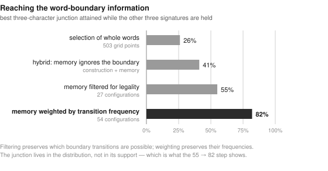
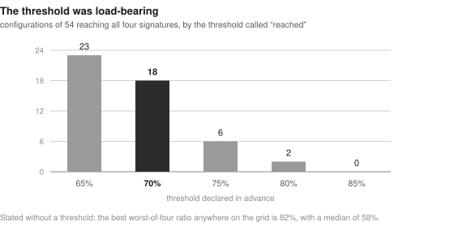
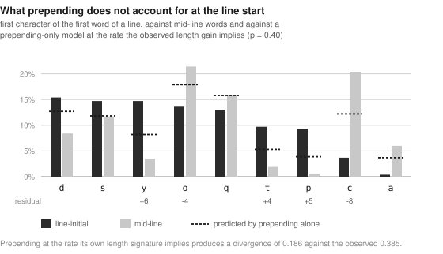

# What a Generator Must Have: Memory, Boundaries and the Voynich Manuscript

**Draft, 3 September 2026. Not submitted. Comments wanted, especially disagreement.**

*Companion paper: "What Survives? An Audit of the Voynich Anomaly Inventory",
which establishes by controlled re-testing which of the manuscript's claimed
peculiarities are real. This paper takes four of them and asks what a generative
mechanism would need in order to produce them. The two share data and controls but
not method, and either can be read alone.*

## Abstract

Michael Greshko, whose Naibbe cipher reproduces several of the Voynich
manuscript's statistics, notes that its draws are memoryless and independent, and
that the manuscript's correlations must require "some kind of memory at play when
generating Voynichese tokens". We ask which memory, and how much.

Four sequence properties are lost entirely by a memoryless model that preserves
the vocabulary and every frequency: the word recurrence profile, word-length
autocorrelation, the correlation between the frequency ranks of adjacent words,
and the mutual information across the word boundary. **No single memory mechanism
supplies more than two of them**, and a generator that *selects whole words*
cannot supply all four at any parameter setting: across 503 unfitted
configurations none reaches all four, and the junction never exceeds 26% of target.

A generator that *constructs* words character by character, drawing each word's
first character from the distribution observed after the previous word's last,
obtains the junction for nothing — 103% of target — and nothing else. The two
architectures are mirrors.

An architecture that reaches all four does exist, and the principle is narrow:
**memory must be subordinate to the boundary, and subordinate by weighting rather
than by filtering.** Filtering memory candidates for a legal initial character
reaches 55% of the junction and all four in none of 27 configurations; weighting
them by the observed transition frequency reaches 82%.

How well it reaches them is best stated without a threshold. Taking each
configuration's *worst* of the four ratios, the best any configuration achieves is
**82%** — so the architecture reproduces all four to about four fifths each, and
no better. The limiting measure is the rank correlation in 27 of 54 configurations
and the junction in 18.

The structural claim makes a prediction about a published generator, and the
prediction holds. The self-citation process of Timm and Schinner (2020) is the most
developed instance of the family that selects whole words: four memories and no
constraint across the word boundary. Their repository publishes its output, so
nothing had to be run. It reaches the recurrence profile at 99% and fails the
junction at 10%, as predicted; it also fails the length autocorrelation at 1%,
which we did not predict, because its source token is drawn from the page rather
than from the preceding word (§4.2).

We then test our own architecture against measures it was not fitted to, and half
the result evaporates: 88.9% of its output consists of actual manuscript words, so its
vocabulary statistics test identity rather than architecture. Of nine held-out
measures only two are informative; it passes one and fails the other — the
line-start divergence — completely, because it has no notion of a line.

Adding the line takes two rules rather than the one the audit proposed. Prepending
a character accounts for the length of line-initial words — the mean gain is
+0.400, and the estimator is unbiased in the generator — but at that rate it
produces less than half the observed first-character divergence, and no choice of
character pool rescues it. An operation that changes the opening character without
changing the length closes the gap and costs nothing on two held-out measures. We
also withdraw, in §8.3, a claim made the same day, because its null model
destroyed the mechanism whose sufficiency was in question.

## 1. Data and method

The data and controls are those of the companion paper: the Zandbergen–Landini
transliteration (ZL3b, 34,024 running-text tokens), with results checked against
five further IVTFF transliterations, two of them in non-EVA alphabets; and
eighteen reference corpora each at least as large as the manuscript. Analysis is
restricted to running text.

Throughout, the measures fitted for each experiment were declared before the run
and the remainder reported as held out, whatever they said. Configurations are run
on three to five seeds; the spread is 0.005–0.11, so differences below about 10%
should not be read. Where an experiment is meant to answer the objection that
parameters are fitted to the manuscript's own figures, it is run as a grid sweep
with no fitting at all, and this is stated.

## 2. Four signatures a memoryless generator loses

The question comes from Michael Greshko, replying on voynich.ninja to an earlier
version of this work. The statistical limitation of the Naibbe cipher, he wrote,
is that "each draw of a word... or of a prefix/suffix... is memoryless and
independent... To get the VMS's long-range correlations and other observed
features, there has to be some kind of memory at play when generating Voynichese
tokens." Our own generator failed in the same place. The obvious next question is
*which* memory, and how much.

Throughout this section the fit targets were declared before each run and the
remaining measures reported as held out. Configurations run on three to five
seeds; the spread is 0.005–0.11, so differences below about 10% should not be
read.

### 2.1 The four

Shuffling the manuscript's own token sequence — the memoryless model that
preserves the vocabulary and every frequency exactly — gives:

| | recurrence d1–5 | d6–20 | decay to 1.0 | length autocorr. | rank corr. | junction |
|---|---|---|---|---|---|---|
| manuscript | 2.44 | 1.86 | d ≈ 47 | +0.134 | +0.0797 | 0.194 |
| memoryless | 1.05 | 0.97 | d ≈ 6 | +0.007 | −0.0009 | 0.000 |

All four are lost. Two of them need a further note, both added after a sweep of
every null model in the companion paper's inventory. The length autocorrelation
had no null recorded at all; a shuffle *within lines* — which preserves each
line's own word lengths and destroys only their order — already produces +0.053
[+0.040; +0.064] over 200 repetitions, so about two fifths of the raw +0.134 is
line-internal homogeneity rather than sequence memory. Against eighteen reference
corpora the manuscript is nonetheless above every one (the range is −0.199 to
+0.085), though the common statement that languages are negative here is wrong:
three of the eighteen are positive. Neither correction changes what follows, since
every model below is scored against the manuscript's own value on the same
measure.

## 3. No single memory supplies more than two

Five mechanisms, each fitted on one measure with the others declared held out.

An **identity cache** — re-emit a word from the last *w* — reproduces the
recurrence profile (2.30 / 2.05 / 41 against 2.44 / 1.86 / 47) and *nothing else*,
at every window from 5 to 300 and every rate from 0.05 to 0.30: length
autocorrelation +0.008, rank correlation −0.002, junction 0.000. It re-emits
particular words, and the other three signatures are about what *kind* of word
comes next.

**Attraction by length** supplies the length autocorrelation; **attraction by
frequency class** supplies the rank correlation (+0.0899 against +0.0797); each
supplies only a quarter to a third of the other.

A **near-neighbour rule** — emit a word at edit distance 1 from the previous one —
supplies *two*: length autocorrelation in full (+0.150 at rate 0.20) and about a
third of the rank correlation. It supersedes attraction-by-length. But it gives no
long-range recurrence at all — d6–20 sits at 0.99 at every rate tried — and
junction reaches 6% at best. An earlier version of this section claimed each
mechanism supplies exactly one signature; that was too clean and is withdrawn.

This mechanism has a signature in the manuscript that was found before us and read
the other way. Schinner (2007) reports that distances between similar words are
geometrically distributed, and a neighbour rule firing with fixed probability
produces exactly that. We confirm the fit: over the first twenty distances the
ratio of observed to geometric runs 0.85–1.14, and the manuscript fits the
geometric better than its own word-shuffled control does. He took it as evidence
for a memoryless process and so for the hoax hypothesis; in the account here the
same mechanism is one of four memories and supplies two of the four signatures.
The observation is the same and only its reading differs, which is worth saying
plainly rather than claiming the fact as new.

This rule deserves a note, because the manuscript makes it available in a way
languages do not: 84.7% of its types have a neighbour at edit distance 1, with
12.06 neighbours each, against Italian 70.6% / 3.48, Spanish 58.6% / 1.89 and
Latin 53.3% / 1.65, all four corpora cut to the manuscript's 34,024 tokens. (An
earlier version quoted 74.0% / 4.04, 73.3% / 2.90 and 56.9% / 1.96 from the
language files taken whole. Larger corpora are denser, so the unmatched
comparison understated the difference; the correction runs in favour of the
claim, which is why we caught it late.) The mechanism is not *unavailable* to Latin — more than half
its types have some neighbour — but a generator following neighbours there would
return to the same word almost every time. The difference is the width of the
choice, and it follows from the density of the companion paper, §5.1.

**Boundary memory** — draw the next word's initial character from the distribution
observed after the current word's final character — supplies the junction, and
that is the interesting case.

## 4. The memories compete for one decision

Three combine without conflict. Neighbour 0.15 + cache 0.10 + frequency 0.10,
three seeds:

| | recurrence | length autocorr. | rank corr. | junction *(held out)* |
|---|---|---|---|---|
| manuscript | 2.44 | +0.134 | +0.0797 | 0.194 |
| model | 2.42 | +0.141 | +0.0778 | **0.007 — 3%** |

Three signatures essentially exact, and the junction at three percent of target.
Giving the boundary mechanism a larger share raises it slowly and at a cost:

| boundary share | junction | % of target | recurrence | length autocorr. | rank corr. |
|---|---|---|---|---|---|
| 0.15 | 0.007 | 3% | 2.42 | +0.141 | +0.0778 |
| 0.30 | 0.021 | 11% | 2.29 | +0.143 | +0.0768 |
| 0.50 | 0.054 | 28% | 2.27 | +0.146 | +0.0757 |
| 1.00 | 0.205 | 106% | 1.04 | +0.026 | +0.0048 |

The junction is reachable only when *every* word is chosen by its initial
character, and there the other three collapse to 43%, 19% and 6% of target. **No
configuration takes all four.** We ran this twice — once on a less efficient
mechanism set, and again after the near-neighbour rule freed a whole mechanism's
worth of budget — and the second run did not change it.

The reason is structural rather than parametric. Each word is chosen once. A
generator that spends that choice on the boundary cannot also spend it on topic,
on length, or on frequency class.

A reader on voynich.ninja objected, reasonably, that changes of this kind should
be demonstrated "without introducing rules based on the VMS text" — and the rates
above are fitted to the manuscript's own figures. The structural claim can be
made without them. Sweeping all four rates over a grid in steps of 0.1 with their
sum at most 1 gives 503 configurations, none of them fitted to anything. Counting
a signature as reached at 70% of target: **no configuration reaches all four.**
Three hundred and three reach exactly three, and in every one of the best the
missing one is the junction, whose maximum among them is 26%. In all the best
configurations the boundary share sits at the grid's ceiling of 0.4 and the
junction still does not exceed a quarter.

The fitted figures earlier in this section show that three signatures are
*attainable*, which is what fitting is for. The claim that the fourth is not
attainable no longer rests on them.

### 4.1 What this constrains

"Some kind of memory" is not one thing. At least four are needed, they are
independent, and a generator that *selects whole words* cannot supply them
simultaneously, however much memory is added, because they share a single
decision.

The junction is the sharp case. It requires essentially the whole selection
budget, which no working generator can give it. That fits what the companion paper's §3 found from the
opposite direction: the junction excess is the one anomaly that vanishes entirely
under affix stripping, falling from 0.194 to 0.036 where Latin, stripped by the
same procedure, moves only from 0.047 to 0.043. It is a property of how a word is
*built*, not of which word is *chosen*.

This constrains cipher hypotheses without refuting any. Naibbe draws whole
ciphertext units from tables; so did our generator; so does any nomenclator or
table cipher. Such a design can be given memory, and with enough of it will
reproduce three of the four signatures — but not the fourth, and not because the
memory is insufficient.

### 4.2 The prediction, tested on a published generator

The most developed published generator of this family is the self-citation
process of Timm and Schinner (2020): the scribe takes a token already written,
preferring the same page and with probability 0.28 the same writing position in
the previous line, and modifies it by adding or removing a glyph (0.20),
combining or splitting (0.30), or replacing one (0.50), under a constraint on
which glyphs may follow which *within* a token. Suggestions keep the shares of
`-in`, `-ol` and `-dy` tokens above thresholds. That is four memories of the kind
tested above — neighbour, positional, page-local, frequency-class — and no
constraint across the word boundary. Our claim therefore makes a prediction about
it, and their repository publishes the generated text, so the prediction can be
checked without running anything.

| signature | manuscript, size-matched | Timm & Schinner | % |
|---|---|---|---|
| recurrence d1–5 | 2.05 | 2.04 | 99% |
| recurrence d6–20 | 1.46 | 1.84 | 126% |
| length autocorrelation | +0.081 | +0.001 | **1%** |
| rank correlation | +0.073 | +0.017 | 24% |
| junction, 1 character | 0.131 | 0.013 | **10%** |

Their output is 10,810 tokens in 1,189 lines, so the manuscript column is cut to
the same line lengths. **The junction fails at 10%, as predicted.** The
length autocorrelation also fails, at 1%, which we did not predict and which is
mechanically informative: their source token is drawn from the page, not from the
immediately preceding word, so adjacent words are not coupled in length. Drawing
the source from the previous word — our near-neighbour rule — supplies that
signature in full. Self-citation from the page and self-citation from the
neighbour are not the same mechanism.

Two things should be said for their generator against ours. On the vocabulary it
does well: 8.63 edit-distance-1 neighbours per type against the manuscript's 9.48
at matched size, 93.1% of types having a neighbour against 81.0%, slot rigidity
15.80 against 13.97. And only 35.9% of its types are actual manuscript words,
against 88.9% for the architecture of §6 — so the objection we raise against
ourselves in §7, that vocabulary measures test identity rather than architecture,
applies to our generator far more than to theirs. Theirs is a model of the
vocabulary; the four signatures are properties of the sequence.

The caveat is the one our own method demands. We tested the configuration and
seed they published, not their parameter space, and by the standard we applied to
ourselves — a grid of 503 points — one configuration is not a family. What the
test establishes is that the published instance behaves as the structural claim
says it must, not that no setting of their parameters could do better.

## 5. Construction instead of selection

An earlier version of this section ended by saying that a mechanism constructing
words character by character, with the boundary constrained during construction,
would not be subject to this trade-off, and that we had not built one. We have now
built it, and the claim was half right.

The generator assembles each word with a character Markov chain and draws its
first character from the distribution observed after the previous word's final
character. There is no word to select, so there is no selection budget. Nothing is
fitted to any of the four signatures.

| | recurrence | length autocorr. | rank corr. | junction |
|---|---|---|---|---|
| manuscript | 2.44 | +0.134 | +0.0797 | 0.194 |
| construction, boundary on | 0.99 (41%) | +0.013 (10%) | +0.003 (4%) | **0.200 (103%)** |
| construction, boundary off | 0.99 | −0.002 | −0.004 | −0.001 (0%) |

**The junction comes for free** — 103% here, 118% for an order-3 chain trained on
types — and collapses to zero if the boundary constraint is removed. That half of
the claim holds: the junction is a property of construction, and no amount of
memory over selection reached more than 26% of it across 503 configurations.

Nothing else comes with it. Recurrence sits at chance, the other two near zero.
The two architectures are exact mirrors.

The obvious move is to combine them: construct each word, and add the word-level
memories on top, since the boundary now costs no selection budget. Fitting the
three word-level measures and holding out the junction, the best configuration
(neighbour 0.25, cache 0.05, frequency 0.10) gives recurrence 83%, length
autocorrelation 106%, rank correlation 58% — and junction 41%.

That is further than either pure architecture reaches, and it is still not all
four. **So we withdraw the claim that construction escapes the trade-off.** It is
subject to a different one: a word emitted from memory is a word that was not
constructed, and therefore carries no boundary constraint. The junction is diluted
roughly as the square of the constructed share — at a memory share of 0.40 it
retains 41% of its full value.

## 6. An architecture that reaches all four

The hybrid fails because memory works by reuse and a reused word carries no
boundary constraint. That suggests memory *subordinate* to the boundary, and there
are two ways to subordinate it.

**Filtering.** Keep only those memory candidates — neighbours, cache entries,
same-frequency-class words — whose initial character is legal after the previous
word's final character. The junction rises from 41% to 55%, and no configuration
out of 27 reaches all four.

**Weighting.** Choose among candidates not uniformly but with weight equal to the
observed transition frequency. The difference is slight and turns out to decide
everything.

| architecture | best junction with three signatures held |
|---|---|
| selection of whole words (503 grid points) | 26% |
| hybrid: construction, memory ignores the boundary | 41% |
| memory *filtered* for legality | 55% |
| **memory *weighted* by transition frequency** | **82%** |

*Figure 4. The best three-character junction each architecture attains while the
other three signatures are held.*

Filtering preserves which transitions are possible; weighting preserves their
frequencies. The junction lives in the distribution of boundary transitions, not
in its support, and the gap between the two forms of subordination demonstrates it.

At neighbour 0.15, cache 0.10, frequency class 0.20, over five seeds:

| | value | % of target |
|---|---|---|
| recurrence d1–5 | 2.013 ± 0.070 | **82%** |
| length autocorrelation | 0.108 ± 0.009 | **81%** |
| rank correlation | 0.062 ± 0.004 | **78%** |
| junction | 0.157 ± 0.006 | **81%** |

And not only there: across a grid of 54 configurations, **eighteen reach all four**
at the 70% threshold declared in advance. In the winning region the junction holds
between 71% and 82% across quite different memory shares, so it is not tracking a
single parameter.

**The threshold is load-bearing, however, and we should have checked it sooner.**
Eighteen configurations at 70% become six at 75%, two at 80%, and none at 85%. The
claim is therefore better made without a threshold at all: taking each
configuration's worst of the four ratios, the best value anywhere on the grid is
82%, with a median of 58%. The architecture reproduces the four signatures to about
four fifths each and no better.

*Figure 5. Configurations of 54 reaching all four signatures, by the threshold
called "reached". The 70% column is the threshold we declared in advance.*

This is a weakening and not a retraction. The differences between architectures
survive it intact: selection of whole words never lifts the junction above 26% at
any of 503 configurations, and construction alone supplies nothing but the
junction. What weakens is the estimate of how well the best architecture does, not
the comparison between them. The measure that limits it is usually the rank
correlation (27 configurations of 54), then the junction (18) — the same two that
constrained the earlier architectures.

**We therefore withdraw the claim that no architecture reproduces all four.** It
held for the three we had tried and was false as a general statement. What
replaces it is a principle rather than a prohibition: **memory must be subordinate
to the boundary, and subordinate by weighting rather than by filtering.** Each word
is either constructed with a boundary-drawn initial character, or taken from
memory with its initial character sampled from the same boundary statistics. The
junction is then not diluted by reuse, and the other three signatures come from
the memories as before.

This sharpens what we can say to cipher hypotheses. It is not that selection of
whole units cannot produce the manuscript's profile; it is that **selection
indifferent to the boundary** cannot. A table cipher that chose its table with
weight depending on the previous unit's final character would acquire the junction
for nothing.

## 7. The same architecture against measures it was not fitted to

The architecture above is fitted to four signatures. Our first generator was
fitted to six measures, matched them to within a few percent, and failed four of
seven measures found afterwards (companion paper, §8). We applied that test here too.

| measure | manuscript | model | % |
|---|---|---|---|
| mean word length | 5.07 | 5.04 | 100% |
| density profile, len 5 / len 3 | 0.73 | 0.74 | 101% |
| chain regeneration | 0.286 | 0.309 | 108% |
| neighbourhood density | 12.06 | 11.44 | 95% |
| Zipf slope | −1.041 | −0.969 | 93% |
| type-token ratio | 0.212 | 0.192 | 91% |
| hapax fraction | 0.697 | 0.595 | 85% |
| three-character junction | 0.246 | 0.182 | 74% |
| **line-start divergence** | 0.385 | 0.018 | **5%** |

Eight of nine within 26% of target, which would be a strong result if the
measures were informative. Most are not. **88.9% of the generated tokens are actual manuscript
words** — the neighbour, cache and frequency-class mechanisms draw them from its
vocabulary, and chain-constructed words often coincide with it as well. The
type-token ratio, hapax fraction, neighbourhood density, Zipf slope and chain
regeneration therefore come out right because the output *is* largely the
manuscript's vocabulary. They test identity, not architecture.

Two measures are not determined by that identity. The three-character junction, at
74%, is a genuine if partial success beyond what was fitted. The line-start
divergence, at 5%, is a complete failure — and a predictable one: the generator has
no notion of a line. It emits a stream which we cut to the manuscript's line
lengths, and nothing in it knows a line has begun. A whole family of the
manuscript's peculiarities — LAAFU, Grove words, words occurring only line-initially
— is out of its reach.

The remaining 11% of output, the words that are not in the manuscript, carry a
defect the four fitted signatures did not catch: their mean length is 8.16
characters against the manuscript's 5.07. The chain does not stop in time, and it
shows on inspection: `dolpchokshal`, `ctheckheody`, `ckhepchor`. Overall mean word
length stays correct only because the copied 89% holds it there.

**So we withdraw "the architecture passes eight of nine held-out measures."** Of
the nine, two are informative and it fails one of them outright. What stands is the
narrower claim: the architecture reproduces four sequence signatures, and does not
reproduce the line-positional structure at all.

What none of this shows: every distribution used — boundary frequencies, the
character chain, the neighbour sets, the frequency classes — is taken from the
manuscript itself, which by the standard raised on the forum is fitting. The claim
is that a class of mechanism exists which reproduces those four signatures where
three other classes do not. Nothing follows about how the manuscript was actually
made. On the threshold that governed the earlier form of this claim, see §6: it is
load-bearing, and the claim is better stated without it.

## 8. The line

The generator of §6 has no notion of a line, and §7 showed what that costs: a
whole family of the manuscript's best-documented peculiarities — LAAFU, Grove
words, words occurring only line-initially — is out of reach. Neither the phenomenon nor the control we use on it is
ours: Currier (1976) observed that particular characters sit almost only at line
edges, and Reddy and Knight (2011, fig. 7) showed the biased distribution
flattening when words are scrambled *within* lines — the same null we use below.
The mechanism is not a guess either; our own audit found these to be largely one
operation, prepending a character to an ordinary word. We added it as a single rule, prepending with
probability *p* at the start of each line, the character drawn from the observed
distribution of prepended ones (`d` 580, `q` 472, `y` 465, `o` 379, `s` 360).
Fitted on line-start divergence alone; everything else held out.

| p | divergence *(fitted)* | Grove fraction | only-initial words | m-final |
|---|---|---|---|---|
| target | 0.385 | 74.9% | 1,033 | 18.4× |
| 0.0 | 5% | 64% | 45% | 1.0× |
| 0.4 | 48% | 85% | 119% | 1.1× |
| 0.8 | **93%** | **103%** | 174% | 1.0× |

One rule lifts all three line-start phenomena together, which confirms by
generation what the audit found by observation: they are one family. But their
proportions do not agree at any single rate, and pursuing that disagreement turned
out to be worth a section of its own.

### 8.1 Two of the three measures were measuring the wrong thing

The disagreement looked like this: divergence wanted *p* ≈ 0.85, the Grove
fraction ≈ 0.75, the count of only-initial words ≈ 0.3. Half of it was in the
measures.

**Only-initial words** was a raw count of types. Prepending manufactures new types
— a character plus a word — and a new type is rare, and a rare type is almost
certain to occur only once and therefore only line-initially. The measure was
counting a by-product. As a *proportion* of line-initial types it wants *p* ≈
0.55; restricted to types occurring at least twice, ≈ 0.60.

**The Grove fraction** asked whether a line-initial word decomposes into a
character plus a word *of the text's own vocabulary*. Prepending raises the
numerator and enlarges the vocabulary at the same time — the same dependence on
vocabulary density that forced the retraction in the companion paper's §3. Scored
against the manuscript's vocabulary, fixed for every model, it wants *p* ≈ 0.70.

Correcting both narrows the disagreement from 0.55 to 0.30, and to 0.25 with the
frequency threshold. It does not remove it.

### 8.2 What is left is a disagreement with word length

Prepending adds exactly one character, so the mean length difference between
line-initial and mid-line words estimates *p* directly. In the generator, where
the true rate is known, the estimator is unbiased: true rates of 0.2, 0.4, 0.6,
0.8 and 1.0 are recovered as 0.18, 0.42, 0.60, 0.77 and 0.97. In the manuscript
the difference is **+0.400**, so *p* ≈ 0.40.

At that rate the generator produces a first-character divergence of 0.186 against
the manuscript's 0.385 — **less than half**. The gap is not in the choice of
characters: repeating the fit with the most favourable pool available, the
observed first characters of line-initial words themselves, gives 0.174, slightly
worse. Prepending at the rate its own length signature implies cannot produce the
line start's first-character distribution, whatever it prepends.

What closes it is an operation that changes the first character without changing
the length. Substituting the first character — same character pool, applied to
line-initial words that were not prepended — gives, at prepending 0.4 and
substitution 0.6 over three seeds:

| measure | manuscript | model | % |
|---|---|---|---|
| length gain *(fitted)* | +0.400 | +0.417 | 104% |
| first-character divergence *(fitted)* | 0.385 | 0.421 | 109% |
| Grove fraction *(held out)* | 0.749 | 0.633 | 85% |
| stem divergence *(held out)* | 0.265 | 0.259 | 98% |

*Figure 6. First character of the first word of a line, against mid-line words
and against a prepending-only model at the rate the observed length gain implies.
The residual is structured: `y`, `p` and `t` in excess, `c` and `o` in deficit.*

The two held-out measures are where prepending alone left them, so the second
operation buys the divergence without costing anything. **The line start is two
operations, not one: a character is added about two fifths of the time, and about
three fifths of the rest have their opening character replaced.** Both draw from
the same small pool.

We state the limit of that. Substitution is the simplest operation of its shape —
changes the first character, leaves the length — and it is the one we tested. Any
other operation of the same shape would do as well, and nothing here identifies
which the scribe performed.

### 8.3 A retraction from the same day

We first read the residual differently, and were wrong in an instructive way.
Stripping the prepended character from line-initial words leaves a stem whose
first-character distribution still differs from mid-line words by 0.265; against a
within-page shuffle this looked decisive (null 0.053, p = 0.005, and 0.271–0.287
across all six transliterations). We concluded that the line start also *selects*
a different word, and stratified by the removed character and by stem length to
rule out the obvious confounds; both stratifications held.

They were beside the point. A prepending-only generator, fitted on word length
alone, produces a stem divergence of 0.257 [0.242; 0.272] over twenty seeds — the
manuscript's 0.265 falls inside it. The residual is what the stripping procedure
manufactures, not evidence of anything beyond prepending. **The null model has to
contain the mechanism whose sufficiency is in question.** A within-page shuffle
destroys prepending along with everything else, so it tests whether line structure
exists, which was never in doubt, rather than whether prepending accounts for it.
No stratification of a comparison against the wrong null can rescue it — the same
lesson as the companion paper's §3.3, arriving by a different route.

### 8.4 The paragraph and the line end

Splitting line starts by the IVTFF paragraph marker shows the family is not
homogeneous. On the 252 first lines of paragraphs, prepending accounts for 73% of
the divergence and the length gain is +1.22; on the 3,725 continuation lines it
accounts for 35% and the gain is +0.34. The gallows behave differently too: at a
paragraph start all four are elevated (`p` 71.9×, `f` 22.5×, `t` 11.3×, `k` 4.4×
over their mid-line rates), while on continuation lines `p` and `t` are elevated
(14.5× and 4.7×) and **`k` is suppressed** at 0.4×. Whatever happens at the top of
a paragraph is not what happens at the start of an ordinary line.

The line *end* is untouched by any of this: `m`-final words stay at 1.0× against
the manuscript's 18.4× at every prepending rate. That is what the audit predicted
— line-final words decompose in the same way only 8% of the time against 77% for
line-initial ones — and it is now confirmed by generation rather than by
observation alone.

The cost to the four earlier signatures is small and falls on one of them. At
p = 0.8: recurrence 91%, length autocorrelation 81%, junction 79%, but rank
correlation drops from 72% to 66%, which makes it the worst of the four and pulls
the configuration's worst-of-four ratio down with it.

## 9. What this constrains, and what it does not

Four independent memories are needed; they compete for a single decision when the
generator selects whole words; the boundary information is unreachable that way and
free the other way; and an architecture reaching all four exists, provided memory
is subordinated to the boundary by weighting. The line start takes two operations
rather than one, and a paragraph's first line is not the same object as an ordinary
line.

For cipher hypotheses this is a constraint and not a refutation. Naibbe draws whole
ciphertext units from tables, as does any nomenclator or table cipher, and such a
design can be given memory. What it cannot do is acquire the junction, unless the
choice of unit is made with weight depending on the previous unit's final
character. That is a small change to describe and a real one to make.

The same applies to accounts that are not ciphers. Timm and Schinner's self-citation
process is a generation mechanism rather than an encipherment, and it belongs to
the same family for this purpose: it selects a written unit and modifies it. On
their own published output it behaves as the structural claim requires, reaching
the recurrence profile and failing the junction at a tenth of target. That is a
prediction met, not a refutation of their proposal, and two things in their favour
should be said with it — their generator models the vocabulary better than ours,
and only 36% of its types are actual manuscript words against our 89%, so the
objection we raise against ourselves in §7 applies to them far less.

Three limitations bound all of it. Every distribution used — boundary frequencies,
the character chain, the neighbour sets, the frequency classes — is taken from the
manuscript itself, so by the standard raised on voynich.ninja this is fitting: the
claim is that a class of mechanism exists which reproduces these signatures, not
that the manuscript was made this way. The 70% threshold was declared in advance
but is load-bearing — none of the grid survives 85% — which is why the result is
better stated as a best worst-ratio of 82%. And the architecture reproduces
sequence structure while reproducing line-positional structure only through the two
rules of §8, which are fitted to the manuscript's own line statistics, so it is at
best a partial account of the text.

## 10. Limitations

Word segmentation is taken as given; the companion paper shows that no conclusion
there depends on it, and the same two re-segmentations leave the signatures here
within their spreads.

The four signatures were chosen because a memoryless model loses them. Other
properties of the manuscript may be equally diagnostic and are not tested here.

The mechanisms tested are the simplest we could construct. That one of them — the
near-neighbour rule — turned out to supply two signatures where we had assumed one
shows that the search over mechanisms is not exhaustive, and nothing here excludes
a mechanism we did not think of.

One error of implementation is worth recording. In an early run of §6 a condition
of the form "is this name defined here" was false inside the function, so the
neighbour mechanism never fired; the script then printed an explanatory note that
rationalised the resulting figures. No statistical control catches a dead branch.

All measurements are by one author with no independent replication. The four
signatures and the held-out measures are defined once, in `scripts/measures.py`,
with seeds and repetition counts in the signatures; `scripts/check_paper.py`
recomputes the load-bearing figures of both papers and fails on any disagreement
with the text. That checks arithmetic and bookkeeping, not judgement: it cannot
tell whether a measure is the right one. Code and parsed corpora are available.

## Acknowledgements

This work depends throughout on transliterations by Zandbergen and Landini,
Takahashi, Claston, and the Friedman group, and on observations by Currier,
Tiltman, Neal, Stolfi, Timm, Jackson, Pelling, Emma May Smith, Zattera, Greshko
and the voynich.ninja community. Where a result is a control under someone else's
observation, we have tried to say whose it is.

## Appendix. Claims audited in this paper

Twenty-two claims, each with its source, the null model applied, and the outcome.
The other seventy-two are in the companion paper. Machine-readable version, with the
numbers for each row, in `scripts/inventory.py`.

| # | Claim | Source | Control applied | Outcome |
|---|---|---|---|---|
| G1 | Memoryless generation cannot produce the manuscript's properties | Greshko 2025 and in reply on the forum; our model independently | shuffling the token sequence as the memoryless model | survives |
| G2 | One kind of memory suffices | ours (test of Greshko's phrasing) | identity cache, windows 5-300, rates 0.05-0.30; held-out measures declared in advance | dissolves |
| G3 | Each memory supplies exactly one signature | ours | near-neighbour rule tested separately, 5 seeds per configuration | **retracted** |
| G4 | Three word-level memories combine without conflict | ours | joint fit on three measures, junction held out | survives |
| G5 | The junction is reachable by memory over word selection | ours | boundary share swept 0 to 1 on two mechanism sets; junction held out in both | weakened |
| G6 | A generator selecting whole words can reproduce the manuscript's profile | ours (corollary) | four memories under a single selection budget | weakened |
| G7 | There are four independent memories | ours | fifth mechanism tested separately, 5 seeds | survives |
| G8 | The near-neighbour rule is available to the manuscript as it is not to languages | ours | share of types having a neighbour, and neighbours per type, in four corpora | weakened |
| G9 | The competition result depends on parameters fitted to the manuscript | ololololo, voynich.ninja (objection) | grid over all four rates without fitting: 503 points, threshold declared in advance | dissolves |
| G10 | Construction of words escapes the trade-off | ours (claim of an earlier draft) | generator built; then hybrid of construction with word-level memory | **retracted** |
| G11 | The junction is a property of how a word is built, not of which is chosen | ours | 503 selection configurations against construction, no fitted parameter | survives |
| G12 | No architecture reproduces all four signatures | ours (conclusion of an earlier draft) | fourth architecture: memory weighted by boundary frequency; 5 seeds and a 54-point grid | **retracted** |
| G13 | Memory must be subordinated to the boundary by weighting, not by filtering | ours | two forms of subordination compared on one grid | survives |
| G14 | The fourth architecture passes eight of nine held-out measures | ours | share of output coinciding with the manuscript's vocabulary; separate analysis of novel words | **retracted** |
| G15 | The fourth architecture reproduces no line-positional structure | ours | line-start first-character divergence against mid-line | survives |
| G16 | The line-start phenomena are one thing, produced by prepending | ours (audit conclusion, tested by generation) | one rule, fitted on line-start divergence alone; Grove fraction, only-initial words and line end held out | weakened |
| G17 | The line end is a different mechanism from the line start | ours (audit prediction) | generation with a line-start mechanism only; line end held out | survives |
| G18 | The architecture claim is independent of the chosen threshold | ours (methodological premise) | grid recomputed at thresholds 60-90%, plus a threshold-free measure: the best worst-of-four ratio | dissolves |
| G19 | The line start is one operation, prepending a character | ours (audit conclusion tested by generation) | fit on two measures (length gain and first-character divergence), Grove fraction and stem divergence held out; competing family with the most favourable character pool | dissolves |
| G20 | The stem of a line-initial word is a different word, so a second selection mechanism exists | ours (claimed and withdrawn the same day) | null model that contains prepending rather than destroying it | **retracted** |
| G21 | Paragraph-first lines and continuation lines behave alike | ours (methodological premise) | separate analysis by the IVTFF paragraph marker, 252 against 3,725 lines | dissolves |
| G22 | The self-citation generator reproduces the manuscript's profile | Timm & Schinner 2020 | the four signatures on their published output, manuscript cut to the same 1,189 lines | weakened |

## References

Amancio, D. R. et al. (2013). Probing the statistical properties of unknown texts. *PLOS ONE* 8(7), e67310.
Bennett, W. R. (1976). *Scientific and Engineering Problem-Solving with the Computer.*
Bowern, C. & Lindemann, L. (2021). The linguistics of the Voynich manuscript. *Annual Review of Linguistics* 7, 285–308.
Currier, P. (1976). Papers on the Voynich manuscript.
Gaskell, D. & Bowern, C. (2022). Gibberish after all?
Greshko, M. (2025). The Naibbe cipher. *Cryptologia.*
Matlach, V., Janečková, A. & Dostál, D. (2022). *PLOS ONE* 17(1), e0260948.
Montemurro, M. & Zanette, D. (2013). Keywords and co-occurrence patterns in the Voynich manuscript. *PLOS ONE* 8(6), e66344.
Parisel, C. (2026a). Evidence of layered positional and directional constraints in the Voynich manuscript. arXiv:2604.19762.
Parisel, C. (2026b). A quantitative confirmation of the Currier language distinction. arXiv:2604.25979.
Reddy, S. & Knight, K. (2011). What we know about the Voynich manuscript. *ACL LaTeCH.*
Rugg, G. (2004). An elegant hoax? *Cryptologia* 28(1).
Stolfi, J. (1997, 2000). Prefix-midfix-suffix decomposition; crust-mantle-core grammar.
Schinner, A. (2007). The Voynich manuscript: evidence of the hoax hypothesis. *Cryptologia* 31(2), 95–107.
Sterneck, R., Polish, A. & Bowern, C. (2021). Topic modeling in the Voynich manuscript. arXiv:2107.02858.
Timm, T. & Schinner, A. (2020). A possible generating algorithm of the Voynich manuscript. *Cryptologia* 44(1), 1–19. Generated text and source: github.com/TorstenTimm/SelfCitationTextgenerator.
Zandbergen, R. (2025). Transliteration files, voynich.nu.
Zattera, M. (2022). A twelve-slot positional structure for Voynichese words.
